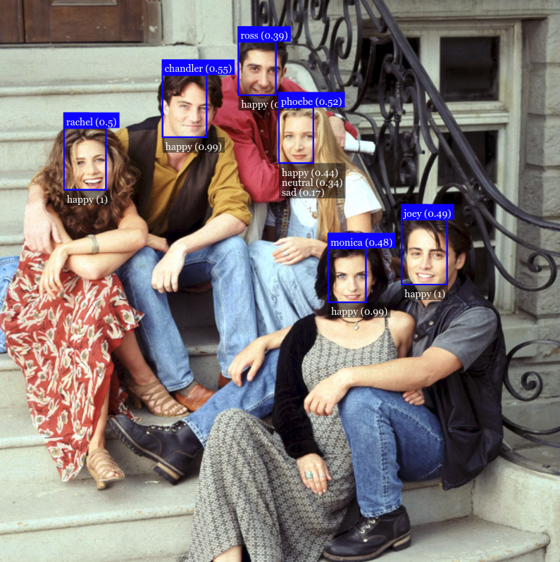

<h3>Face Recognition System with faceapi.js 👩🏻</h3>

<h4>What is face-api.js? 👾</h4>

<i>face-api is a JavaScript library created by Vincent Mühler., to detect face via browser. It is built above tensorflow.js core API. It supports  Face Detection, Face Recognition, Face Expression, Age and Gender Detection.</i>

<h4>Result</h4>

<h4>Wanna know more 📚</h4>

<i>Check out my medium blog 👉🏻</i>
 

  

